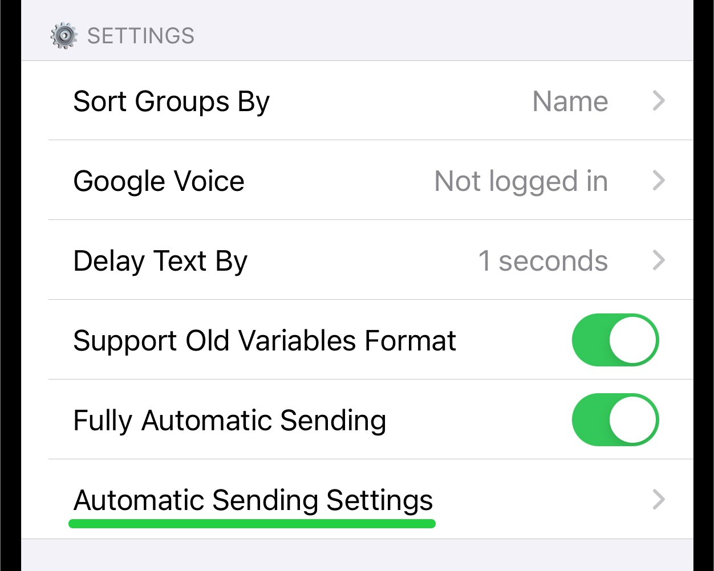
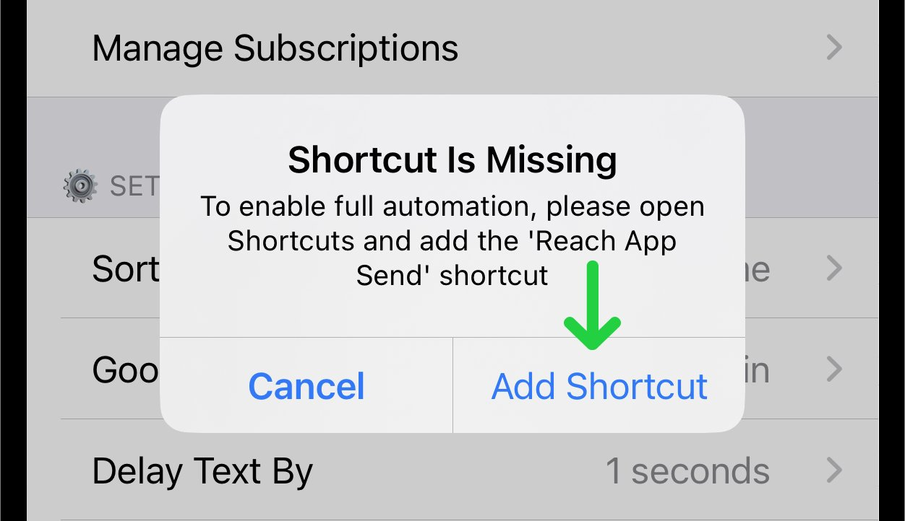
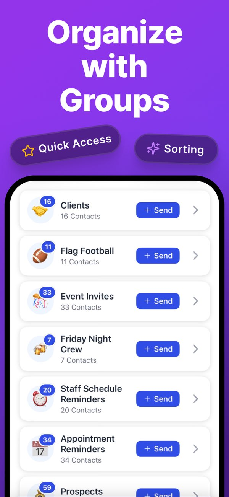
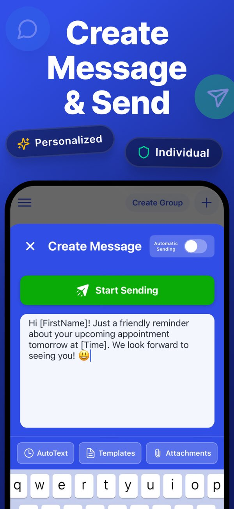
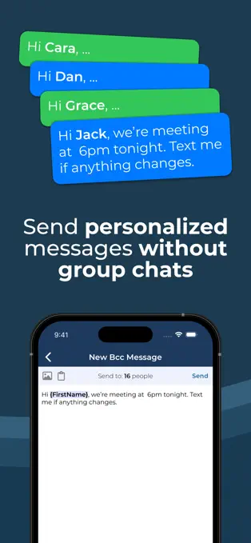
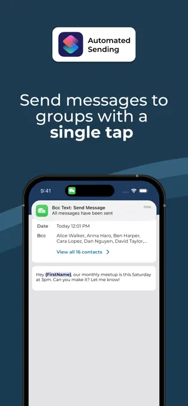

# Group SMS 경쟁 앱 상세 조사

조사일: 2026-07-12

## 목적과 범위

이 문서는 iPhone에서 개인별 문자 메시지를 순차 발송하는 상용 앱의 실제 작동 방식, 메뉴 구성, 자동화 설정, 공개 스크린샷을 비교하고 `소희가 간다`에 반영할 제품 및 구현 항목을 정리한다.

집중 조사 대상:

- Reach: 자동화 설치와 상태 점검이 가장 상세한 사례
- Quick Send: 대상 선택부터 작성·발송까지 단순화한 사례
- BCC Text: 개인정보 보호, 개인화 미리보기, 발송 채널 선택 사례

중요한 공통점은 세 앱 모두 앱에서 대상·템플릿·과금·기록을 관리하고, iOS의 실제 자동 발송 구간은 Apple Shortcuts에 위임한다는 점이다. 설치된 단축어가 사용자에게 보이는 구조여도 상용 제품이 성립하며, 제품의 핵심 가치는 단축어 자체보다 데이터 모델, 검증, 개인화, 오류 복구와 사용 흐름에 있다.

## 한눈에 보는 비교

| 항목 | Reach | Quick Send | BCC Text | 소희가 간다 적용 판단 |
| --- | --- | --- | --- | --- |
| 기본 흐름 | 템플릿 → 그룹 → 대상 → 발송 | 연락처 → 메시지 → 발송 | 대상 → 메시지 → 개인화 발송 | 3단계 작성 + 별도 사전점검 |
| 대상 관리 | 앱 그룹, CSV, 연락처 | 연락처, 그룹, Google Sheets, 수동 | 연락처, 그룹, CSV | 기존 고객리스트/필터/스케줄 활용 |
| 개인화 | 템플릿 필드, 변형 메시지 | AutoText, 템플릿, 대상별 미리보기 | 이름·접두어 등 토큰, 대상별 수정 | 기존 템플릿 + 대상별 최종 미리보기 |
| 첨부 | 사진·파일, 첨부 권한 별도 | 사진·파일, 다중 첨부 일부 지원 | 사진, 임시 업로드 후 삭제 | 1장부터 시작, 권한/용량 사전검사 |
| 자동화 준비 | 설치 확인 → 추가 → 테스트 → 활성화 | iOS Shortcut 안내와 자동발송 토글 | Shortcut 실행, 플랫폼별 라우팅 | 설치·버전·권한·시험 상태 카드 필요 |
| 속도 | 고정/랜덤 지연 | 자동 발송, 통신사 제한 안내 | 약 1~2초 간격, 20~100명 권장 | 고정/랜덤/묶음 휴식 + 보호선 |
| 중단/복구 | Shortcuts Stop, 앱 Abort | 진행률 중심 | 중단 시 재시작/남은 대상 수동 처리 안내 | 중단, 미확정 대상 분리, 안전 재개 필수 |
| 발송 채널 | Messages, Google Voice, WhatsApp 등 | Messages, Google Voice | Messages, Google Voice, WhatsApp | iOS 1차 Messages, 채널 확장 가능한 모델 |
| 개인정보 | 별도 클라우드 백업 옵션 | 수집 항목이 상대적으로 많음 | App Store `Data Not Collected` | 로컬 우선 + Drive 백업 범위 명시 |
| 무료 범위 | 제한된 그룹/연락처 | 15건 | 3건 | 테스트 번호/소량 캠페인 무료 검토 |

## Reach

### 공개 화면

출처: [Reach Fully Automatic Sending Mode](https://www.reachtheapp.com/articles/docs-ios-fully-automatic-sending/preview)

### 작동 방식

1. 하단 도구막대의 `Settings`로 이동한다.
2. `Fully Automatic Sending`을 켠다.
3. 앱이 Shortcuts 설치 여부를 확인한다.
4. 단축어가 없으면 `Shortcut Is Missing` 팝업에서 `Add Shortcut`으로 이동한다.
5. 사용자가 `Reach App Send` 단축어를 추가한다.
6. 앱으로 돌아오면 단축어 기능 시험을 실행한다.
7. 성공하면 `Full Automation Enabled` 상태로 전환한다.
8. `Automatic Sending Settings`에서 메시지 채널별 자동화 여부와 지연 시간을 정한다.
9. 첫 발송과 첫 첨부 발송 때 각각 필요한 권한을 승인한다.

이 흐름의 핵심은 단축어 설치 안내를 문서 링크 하나로 끝내지 않고, 앱이 `미설치`, `시험 필요`, `활성화됨` 상태를 구분한다는 것이다.

### 메뉴와 설정

- 하단 `Settings`
- `Fully Automatic Sending` 토글
- `Automatic Sending Settings`
- 채널별 자동 발송 토글
- `Delay Text By`
- 고정 지연 시간
- 랜덤 지연 시간
- Google Voice 연결 상태
- 이전 템플릿 변수 형식 호환 옵션

Reach의 발송 흐름은 템플릿 편집 화면에서 발송을 시작한 뒤 그룹을 고르고, 기본 선택된 연락처를 체크박스로 조정하는 방식이다. 선택 수와 전체 선택 도구가 하단에 나타난다.

### 중단과 오류 처리

- Shortcuts가 전면에 있을 때 `Stop`을 누른 뒤 Reach로 돌아와 중단을 확정한다.
- 이미 Reach로 돌아온 경우 앱 중앙의 `Abort`로 중단한다.
- 완료 시 `All Sent`, 오류 시 오류 메시지를 표시하고 재시도를 안내한다.

참고: [Reach 발송 중단 안내](https://www.reachtheapp.com/articles/docs-ios-how-to-stop-message-sending-in-fully-automatic-sending-mode), [Reach 템플릿 발송 안내](https://www.reachtheapp.com/articles/docs-ios-send-message)

### 반영할 점

- 단축어 상태를 하나의 토글로 표현하지 않고 상태 기계로 관리한다.
- 일반 문자 권한과 첨부 권한을 별도로 시험한다.
- 고정/랜덤 지연을 같은 설정 화면에서 선택하게 한다.
- 앱과 Shortcuts 양쪽에서 발송 중단 경로를 제공한다.
- 설치된 단축어의 버전을 앱이 점검하고 갱신을 안내한다.

### 그대로 따르지 않을 점

- 자동 발송 설정을 일반 설정 목록 깊숙이 두지 않는다. 첫 캠페인에서는 작성 흐름 안에서도 준비 상태가 보여야 한다.
- `All Sent`를 실제 통신사 전달 완료로 해석하지 않는다. 우리 앱은 `발송 요청 완료`로 표기한다.

## Quick Send

### 공개 화면

출처: [Quick Send App Store](https://apps.apple.com/us/app/quick-send-mass-text-message/id6447712531)

### 작동 방식

Quick Send는 제품 흐름을 명확한 3단계로 설명한다.

1. `Add Your Contacts`
   - iPhone 연락처
   - 기존 연락처 그룹
   - Google Sheets
   - 수동 추가
2. `Craft Your Message`
   - AutoText 개인화 필드
   - 저장 템플릿
   - 사진/파일 첨부
   - 이모지
   - 대상별 미리보기
3. `Send It Off`
   - 각 메시지를 확인하는 수동 모드
   - iOS Shortcut을 실행하는 원탭 모드
   - iMessage/SMS 또는 Google Voice

공식 설명: [Quick Send How It Works](https://quicksendapp.com/how-it-works)

### 메뉴와 화면 구성

- 햄버거 메뉴
- 그룹 목록
- `Create Group`
- 그룹 행의 고객 수와 즉시 `Send` 버튼
- `Create Message`
- 상단 `Automatic Sending` 토글
- 본문 편집기
- `AutoText`, `Templates`, `Attachments` 도구
- 눈에 띄는 `Start Sending` 버튼
- Settings의 테마, 백업, 정렬, CSV 내보내기 관련 기능

App Store 변경 이력에서는 다음 운영 기능도 확인된다.

- 메시지 초안
- 그룹 내 검색
- 그룹 간 연락처 이동
- 날짜, 금액, 전체 이름 등 AutoText 확장
- 다중 사진·동영상·파일 첨부의 수동 발송
- 자동 일일 클라우드 백업과 백업 파일 내보내기
- 라이트/다크/자동 테마
- 소형 화면 대응
- 연락처 정렬과 재배치

### 설정 및 제한 안내

- 처음 15건 무료, 이후 Pro 구독
- Pro에 자동 발송용 iOS Shortcut과 Google Voice 포함
- Google Sheets 가져오기는 고정 헤더를 요구하고 50명 이하를 권장한다.
- 공식 가이드는 큰 묶음과 알려지지 않은 번호 대상 발송이 통신사 필터에 걸릴 수 있음을 안내한다.

가격 및 제한: [Quick Send Pricing](https://quicksendapp.com/pricing), [Google Sheets 가져오기](https://quicksendapp.com/faq/google-sheets)

### 반영할 점

- 그룹 행에 별도 상세 진입 없이 바로 `단체문자` 명령을 제공한다.
- 작성 화면에서 개인화, 템플릿, 첨부를 한 줄 도구막대로 제공한다.
- 대상 → 작성 → 발송의 3단계를 유지한다.
- 캠페인 초안 저장과 최근 발송 재사용을 지원한다.
- 대상별 최종 본문 미리보기를 제공한다.
- 앱 업데이트 전후 데이터 백업과 복원 경로를 명확히 한다.

### 주의할 점

App Store에는 소규모 시험은 성공했지만 행사 당일 200명 이상 발송이 실패했다는 리뷰와, 통신사 또는 메시지 제공자의 제한 가능성을 설명한 개발자 답변이 있다. 따라서 우리 앱은 `무제한`, `완전 자동`, `모두 발송됨`을 과장해서 표시하면 안 된다.

또한 Quick Send의 App Store 개인정보 표시에는 연락처·식별자·사용 데이터 등 여러 항목이 포함된다. `소희가 간다`는 고객 데이터가 어디에 저장되고 Google Drive에 무엇이 백업되는지 더 명확하게 보여주는 방향이 유리하다.

## BCC Text

### 공개 화면

출처: [BCC Text App Store](https://apps.apple.com/us/app/bcc-text-private-mass-texting/id1613103349)

### 작동 방식

1. 연락처를 직접 선택하거나 CSV에서 가져온다.
2. 자주 사용하는 대상을 그룹으로 저장한다.
3. 한 번 작성한 메시지에 이름·접두어 등의 개인화 토큰을 넣는다.
4. 필요하면 사진을 첨부한다.
5. 대상별 개인화된 메시지를 미리 확인한다.
6. iOS Shortcut이 각 연락처의 설정에 따라 Messages, Google Voice 또는 WhatsApp으로 라우팅한다.

공식 설명: [BCC Text 개요](https://bcctext.com/what-is-bcctext), [다중 채널 발송 안내](https://bcctext.com/blog/whatsapp-google-voice-mass-messages)

### 메뉴와 설정에서 확인되는 특징

- 대상 그룹과 CSV 가져오기
- 재사용 메시지 템플릿
- 개인화 토큰
- 대상별 선호 발송 채널
- 사진 첨부
- Shortcuts 자동화
- 발송 전 대상별 개인화 결과 확인 및 개별 수정
- VoiceOver와 색상 외 구분 지원

App Store의 최신 설명은 `Preview Before Sending` 옵션을 켜면 모든 개인화 메시지를 발송 전에 검토하고, 특정 말풍선을 눌러 그 고객의 문구만 수정할 수 있다고 안내한다. `{Prefix}` 토큰도 제공한다.

### 개인정보와 첨부 처리

- App Store 개인정보 표시는 `Data Not Collected`다.
- 연락처 데이터는 기기에 유지한다고 설명한다.
- Shortcuts 첨부 발송에 필요한 사진은 임시로 사용하고 발송 후 삭제한다고 설명한다.

이 부분은 고객정보를 다루는 `소희가 간다`가 적극적으로 참고할 수 있는 차별점이다.

### 운영 범위

- 3건 무료 시험
- 월간 또는 연간 구독
- 공식 사이트는 20~100명 규모에 적합하고 500명 이상은 기업용 SMS 플랫폼을 권장한다.
- 메시지 간 약 1~2초의 사람다운 속도를 언급한다.
- 발송 도중 Shortcuts가 중단되면 기기를 잠금 해제 상태로 유지하고, 남은 고객을 재시작하거나 수동 처리하라고 안내한다.

가격 및 범위: [BCC Text 공식 사이트](https://bcctext.com/)

### 반영할 점

- 최종 확인 화면에서 대상별 개인화 결과를 직접 수정하게 한다.
- 고객별 선호 발송 채널을 저장할 수 있는 데이터 모델을 마련한다.
- 첨부파일의 임시 저장, 만료, 삭제 시점을 명시한다.
- 개인정보 화면에 로컬 저장과 Drive 백업 범위를 분리해서 설명한다.
- VoiceOver, Dynamic Type, 색상 외 상태 구분을 발송 화면에도 적용한다.

### 주의할 점

BCC Text 공식 페이지의 일부 FAQ는 자동화 설명과 달리 대상마다 전송을 눌러야 한다고 적혀 있어 최신 App Store 설명과 충돌한다. 기능 구현 판단은 현재 앱 버전과 실제 단축어 시험을 기준으로 해야 하며, 경쟁사 문구만으로 완전 자동 동작을 단정해서는 안 된다.

## 소희가 간다 권장 정보구조

### 진입점

- 고객리스트 카드: `단체문자`
- 고객 다중 선택 도구막대: `단체문자`
- 오늘 스케줄 선택 도구막대: `단체문자`
- 단체문자 탭: 초안, 진행 중, 기록
- 설정: 단축어 및 발송 정책 관리

고객 선택 맥락에서는 바로 캠페인을 만들 수 있어야 하며, 설정 탭을 먼저 찾아가도록 강제하지 않는다.

### 화면 1: 자동화 준비

상태 카드:

- 단축어 미설치
- 설치됨, 시험 필요
- 문자 권한 필요
- 첨부 권한 필요
- 사용 가능
- 업데이트 필요

명령:

- `단축어 설치`
- `설치 확인`
- `시험 발송`
- `단축어 업데이트`

첫 캠페인에서만 전체 화면으로 안내하고, 이후에는 작성 화면 상단에 작은 상태 표시를 둔다.

### 화면 2: 대상 선택

- 고객리스트/오늘 스케줄/검색·필터 결과 표시
- 대상 체크박스
- 전체 선택/전체 해제
- 전화번호 없음, 중복, 수신 제외, 최근 발송 대상 자동 분리
- 유효 대상/제외 대상 수를 실시간 표시
- 제외 사유를 눌러 목록 확인

### 화면 3: 메시지 작성

- 템플릿 선택
- 본문 입력
- 개인화 필드 삽입
- 사진/파일 첨부
- 고정/랜덤 발송 간격
- 캠페인 초안 저장
- 대상별 미리보기

하단 도구막대는 `개인화`, `템플릿`, `첨부`로 단순화한다.

### 화면 4: 발송 전 점검

반드시 보여줄 항목:

- 발송 대상 수
- 제외·중복·잘못된 번호 수
- SMS/LMS/MMS 예상 구분과 첨부 여부
- 예상 소요시간
- 오늘 발송 요청 누적 수와 보호선
- 테스트 번호 포함 여부
- 단축어/권한/앱 전면 상태
- 개인화 빈 값

버튼은 `발송 시작` 하나로 두되, 위험 조건이 있으면 원인을 해결하기 전까지 비활성화한다.

### 화면 5: 발송 진행

- 현재 대상 고객명
- 요청 완료/전체/남은 수
- 경과시간과 예상 남은 시간
- 다음 대상
- 일시정지 또는 중단
- 앱을 전환하거나 화면을 잠그지 말라는 짧은 상태 안내

앱이 확인 가능한 것은 단축어의 발송 요청 단계까지다. 화면 문구는 `전달 완료`가 아니라 `발송 요청`으로 통일한다.

### 화면 6: 결과와 복구

대상을 세 범주로 구분한다.

- 요청 완료
- 요청 전
- 상태 미확정

중단 후 재개할 때 `상태 미확정` 대상은 자동으로 다시 보내지 않는다. 사용자가 목록을 확인하고 재발송 대상을 명시적으로 선택해야 중복 문자를 줄일 수 있다.

## 구현 우선순위

### P0: 실제 사용 전 필수

1. 단축어 준비 상태 카드와 설치·시험 흐름
2. 3단계 캠페인 작성 화면
3. 발송 전 대상·번호·개인화·한도 사전점검
4. 진행률, 중단, 요청 완료/미확정 분리
5. 안전한 재개와 중복 방지
6. 고정/랜덤 지연과 묶음 휴식
7. 테스트 모드와 실사용 모드의 명확한 구분

### P1: 검증 후 추가

1. 사진 1장 첨부와 별도 권한 시험
2. 대상별 개인화 문구 수정
3. 캠페인 초안, 복제, 재사용
4. 단축어 버전 점검과 업데이트
5. 접근성 및 개인정보 설정 화면
6. 무료 시험 범위와 StoreKit 과금

### P2: 장기 확장

1. 다중 첨부와 파일 형식별 검증
2. 고객별 선호 발송 채널
3. Android 발송 드라이버 분리
4. 대규모 발송이 필요한 사용자를 위한 서버 SMS 전환 안내

## 피해야 할 설계

- 모든 자동화 설정을 일반 설정 탭에만 숨기는 구조
- 한 화면에 대상, 메시지, 속도, 테스트, 로그를 모두 넣는 긴 Form
- 단축어 callback을 실제 통신사 전달 성공으로 기록하는 것
- 중단된 캠페인의 전체 대상을 자동 재발송하는 것
- `무제한`, `완전 자동`, `100% 전달` 표현
- 통신사 제한을 우회한다고 오해할 수 있는 랜덤 지연 설명
- 첨부파일을 언제 삭제하는지 알 수 없는 임시 저장

## 제품 결론

가장 적합한 조합은 다음과 같다.

- Reach에서 `단축어 설치·시험·권한 상태 관리`를 가져온다.
- Quick Send에서 `3단계 작성 흐름과 그룹에서 즉시 발송`을 가져온다.
- BCC Text에서 `대상별 최종 미리보기, 개인정보 보호, 첨부 수명주기`를 가져온다.
- `소희가 간다`만의 차별점으로 고객리스트, 방문 상태, 스케줄, 지도 선택, 고객 히스토리를 발송 대상과 기록에 직접 연결한다.

단축어는 얇은 실행 어댑터로 유지하고, 유료 제품의 핵심은 앱 내부의 고객 데이터, 캠페인 작성, 정책 검증, 중복 방지, 로그와 복구 흐름에 둔다.
